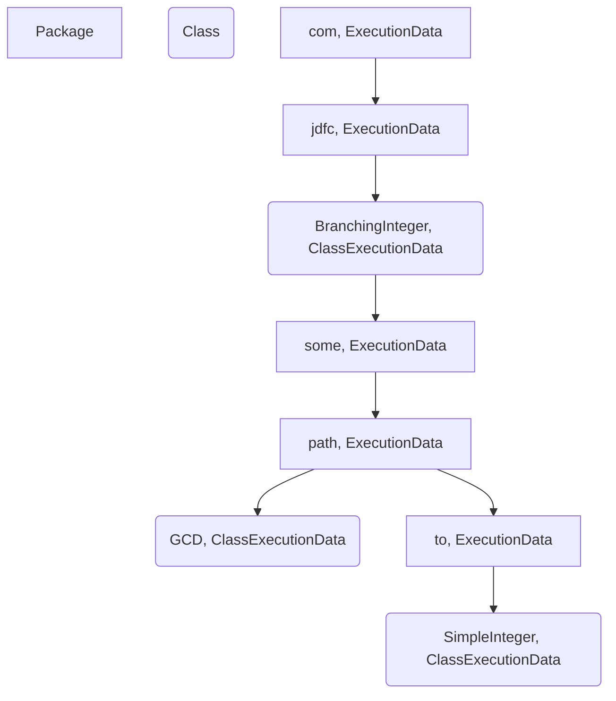

# JDFC - Java Data Flow Coverage

## JDFC Program Flow


**AgentMojo.execute**
- Extract Agent from plugin jar
- Add agent argument to command line

**Agent.premain**
- CoverageDataStore: save project info (all relevant dirs)
- CoverageDataStore: load .class files into tree structure e.g.

- ClassExecutionData holds JavaParser tree for class
- constructor loads methods from JavaParser
    - <*builder: ()LBuilder;, MethodData>* (Problem: full inner class name would be ()Lcom/jdfc/apache/Option$Builder)
- add JDFCTransformer
- add Shutdown hook

NOTE: Classes with tests get loaded by class loader

**JDFCTransformer.transform**
- filter classes to instrument
- call JDFCInstrument.instrument

**JDFCInstrument.instrument**
- get classExData by name (e.g. BranchingInteger)

**CFGCreator.createCFGsForClass**
- CFGLocalVariableClassVisitor.visit
    - visitField: collects field information for class: Set<*ProgramVariable>*
    - visitMethod: CFGLocalVariableMethodVisitor
        - local variable information for all methods in the class: Map<*internalMName, <idx, LocalVariable>>*

- CFGNodeClassVisitor.visit
    - visitMethod: create cfg if not interface or inner class
        - CFGNodeMethodVisitor
            - visitEnd
                - edges
                - CFG for every method: Map<*internalMName, cfgImpl>*

DataTypes:
```
CoverageDataStorage {

}

LocalVariable {
    name: String
    descriptor: String
    signature: String
    index: int
}

```

