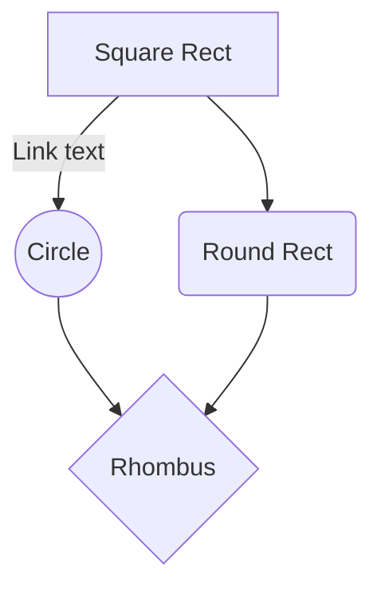

# JDFC - Java Data Flow Coverage

## JDFC Program Flow



**AgentMojo.execute**
- Extract Agent from plugin jar
- Add agent argument to command line

**Agent.premain**
- CoverageDataStore: save project info (all relevant dirs)
- CoverageDataStore: load .class files into tree
- <com, ExecutionData> : package
- <jdfc, ExecutionData> : package
- <BranchingInteger, ClassExecutionData>: package
- ClassExecutionData holds JavaParser tree for class
- constructor loads methods from JavaParser
- <*builder: ()LBuilder;, MethodData>*
- add JDFCTransformer
- add Shutdown hook

NOTE: Classes with tests get loaded by class loader

**************************************************JDFCTransformer.transform**************************************************

- filter classes to instrument
- call JDFCInstrument.instrument

**************************************************JDFCInstrument.instrument**************************************************

- get classExData by name (e.g. BranchingInteger)

************************CFGCreator.createCFGsForClass************************

- CFGLocalVariableClassVisitor
- local variable information for all methods in the class: Map<internalMName, <idx, LocalVariable>>
- collects field information for class: Set<ProgramVariable>
- CFGNodeClassVisitor
- CFG for every method: Map<internalMName, cfgImpl>

DataTypes:
```
CoverageDataStorage
{

}```