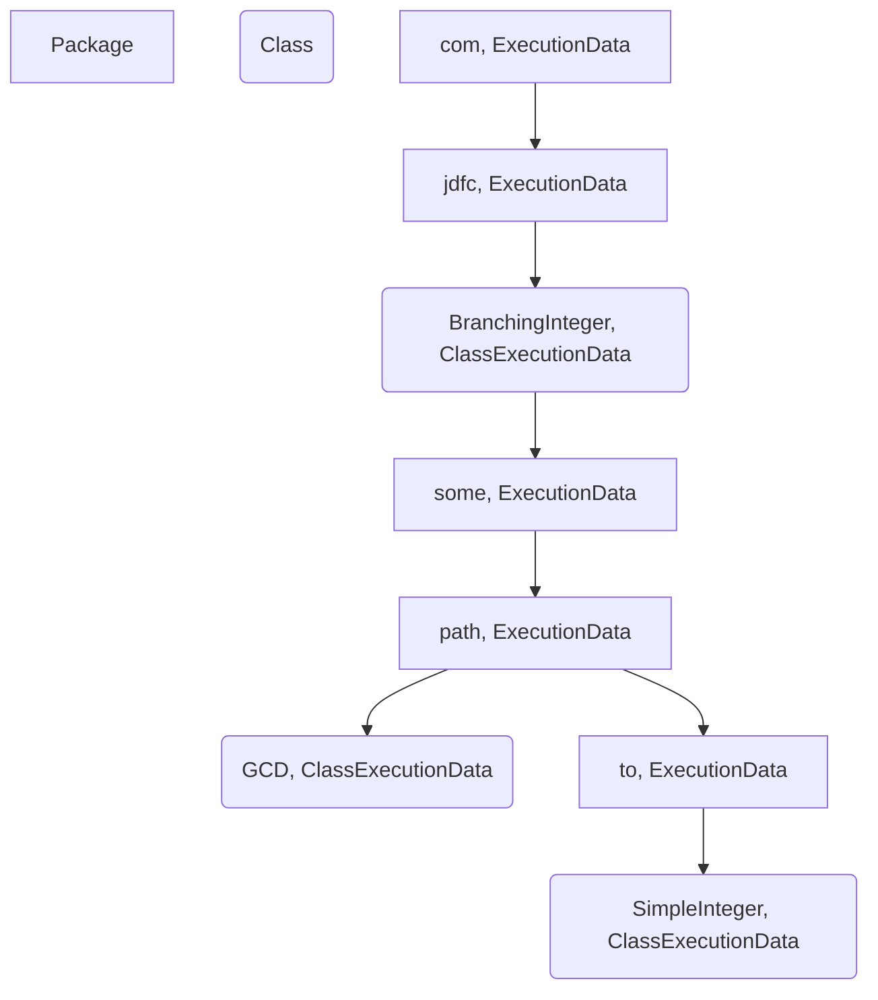

# JDFC - Java Data Flow Coverage

## Entities
```
// Local variable in a method
LocalVariable {
    name: String,
    descriptor: String,                                             // ASM desc
    signature: String,                                              // ASM signature
    index: int,
}

// Variable in the analysis. Can be local var or field
ProgramVariable {
    owner: String,                                                  // ASM desc
    name: String,
    descriptor: String,                                             // ASM desc
    instructionIndex: int,                                          // ASM instructionIndex
    lineNumber: int,                                                // Line number from compiled class file
    isDefinition: boolean,
}

// Definition-Use Pair containing type and coverage info
DefUsePair {
    type: String,                                                   // ASM desc
    definition: ProgramVariable,
    usage: ProgramVariable,
    covered: boolean,
}

// Delete
InterProceduralMatch {
    definition: ProgramVariable,
    callSiteDefinition: ProgramVariable,
    String methodName,                                              // assumption: max: (II)I
    String callSiteMethodName,
}

// Node in a method cfg
CFGNode {
    definitions: Set<ProgramVariable>,
    uses: Set<ProgramVariable>,
    index: int,
    opcode: int,
    predecessors: Set<CFGNode> predecessors,
    successors: Set<CFGNode> successors,
    reachOut: Set<ProgramVariable>
    reach: Set<ProgramVariable>
}

// Control flow graph
CFGImpl implements CFG {
    methodName: String,                                             // max: (II)I (internalMethodName)
    nodes: NavigableMap<Double, CFGNode>,
    edges: Multimap<Double, Double>,
    localVariableTable: Map<Integer, LocalVariable>,
    isImpure: boolean,
}

// Relevant dataflow information of method including a source syntax tree and cfg
MethodData {
    total: int,
    covered: int,
    rate: double,
    access: int, (ASM or JavaParser?)
    name: String,                                                   // e.g. max
    desc: String,                                                   // ASM desc (self built)
    exceptions: String[]                                            // [ASM desc, ASM desc, ..]
    srcAst: MethodDeclaration           @JsonIgnore                 // JavaParser
    cfg: CFG                            @JsonIgnore
    pairs: Set<DefUsePair>
    params: Set<ProgramVariable>                                    // method params
    beginLine: int                                                  // begin.line from JavaParser
    endLien: int                                                    // end.line from JavaParser
}

// Super type of package and class data
ExecutionData {
    total: int,
    covered: int,
    methodCount: int,
    rate: double,
    fqn: String,
    name: String,
    parentFqn: String,
}

// Class dataflow information wrapper
ClassExecutionData extends ExecutionData {
    logger: Logger,
    relativePath: String,
    srcFileAst: CompilationUnit,
    ciAst: ClassOrInterfaceDeclaration,
    methodCFGs: Map<String, CFG>,
    methodFirstLine: Map<String, Integer>,                          // delete
    methodLastLine: Map<String, Integer>,                           // delete
    defUsePairs: TreeMap<String, List<DefUsePair>>,                 // could be used for intraclass dupairs
    defUsePairsCovered: TreeMap<String, Map<DefUsePair, Boolean>>,  // delete
    variablesUncovered: Map<String, Set<ProgramVariable>>,
    variablesCovered: Map<String, Set<ProgramVariable>>,
    interProceduralMatches: Set<InterProceduralMatch>,              // delete
    fields: Set<ProgramVariable>,
    methods: Map<Integer, MethodData>,
}

// Node in execution data tree, which also serves as project structure representation
ExecutionDataNode<T extends ExecutionData> {
    data: T,
    parent: ExecutionDataNode<T>,
    children: Map<String, ExecutionDataNode<T>>,
}
```
CoverageTracker {
    singleton: CoverageTracker,
    currentClassExecutionData: ClassExecutionData                   // We hold this for some reason
    classExecutionDataMap: Map<String, ClassExecutionData>
}
```


## JDFC Program Flow
**AgentMojo.execute**
- Extract Agent from plugin jar
- Add agent argument to command line

**Agent.premain**
- CoverageDataStore: save project info (all relevant dirs)
- CoverageDataStore: load .class files into tree structure e.g.

- ClassExecutionData holds JavaParser tree for class
- constructor loads methods from JavaParser
    - <*builder: ()LBuilder;, MethodData>* (Problem: full inner class name would be ()Lcom/jdfc/apache/Option$Builder)
- add JDFCTransformer
- add Shutdown hook

NOTE: Classes with tests get loaded by class loader

**JDFCTransformer.transform**
- filter classes to instrument
- call JDFCInstrument.instrument

**JDFCInstrument.instrument**
- get classExData by name (e.g. BranchingInteger)
- CFGCreator.createCFGsForClass
    - CFGLocalVariableClassVisitor.visit
        - visitField: collects field information for class: Set<*ProgramVariable>*
        - visitMethod: CFGLocalVariableMethodVisitor
            - local variable information for all methods in the class: Map<*internalMName, <idx, LocalVariable>>*

    - CFGNodeClassVisitor.visit
        - visitMethod: create cfg if not interface or inner class
            - CFGNodeMethodVisitor
                - visitEnd
                    - edges
                    - CFG for method: Map<*internalMName, cfgImpl>*
                    - put first line: <internalMethodName, firstLine>
                    - put last line: <internalMethodName, lastLine>
                    - set cfg, params in MethodData (findByInternalMethodName fails)
        - visitEnd
            - CoverageDataStore finish class execution data setup
                - set methodCFGs in class: Map<internalMethodName, CFG>
                - initialize def use lists (??)
                - calculate reaching definitions
                - calculate intra procedural def use pairs
- InstrumentationClassVisitor.visit
    - visitMethod
        - if instrumentation required
        - InstrumentationMethodVisitor.visit
            - visitVarInsn:
            - visitIincInsn:
                - insert call CoverageDataStore.invokeCoverageTracker (internalMethodName, currentLineNumber)

**Run Tests**
- CoverageDataStore.invokeCoverageTracker is basically doing nothing
- CoverageTracker.addLocalVarCoveredEntry
    - update classExData by className
        - if its not null and not the same class
        - if the map does not already contain the class
        - find the class node from the tree
        - extract the data
        - put it into the map
    - check if var is definition by opcode
    - find local variable by internalMethodName, insn index from localVariableTables (!!)
    - add current class to tested classes (relativePath)
    - remove current class from untested classes (relativePath)
    - if localvar is not null
        - create a program variable
        - add local variable to variablesCovered in class by internalMethodName (!!)

**Shutdown hook**


